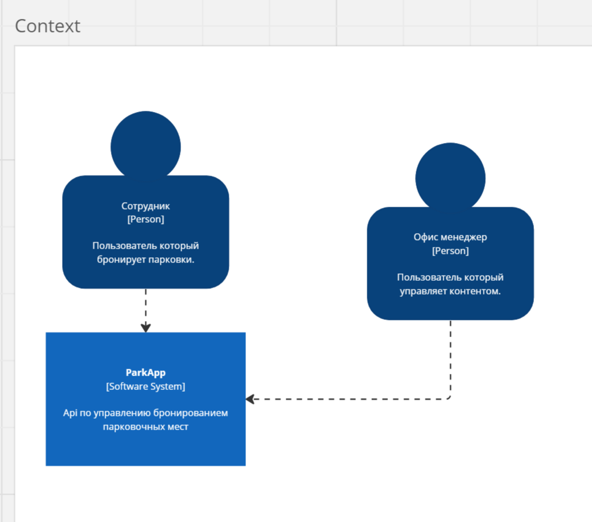
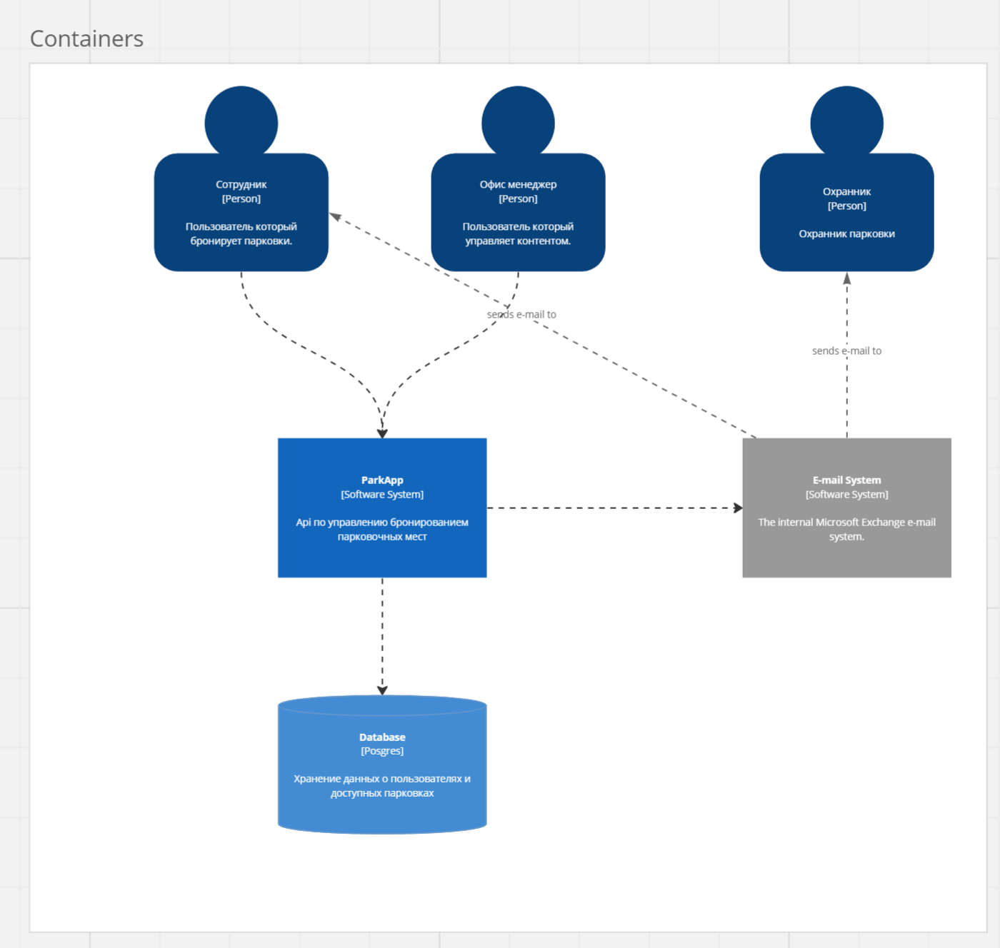
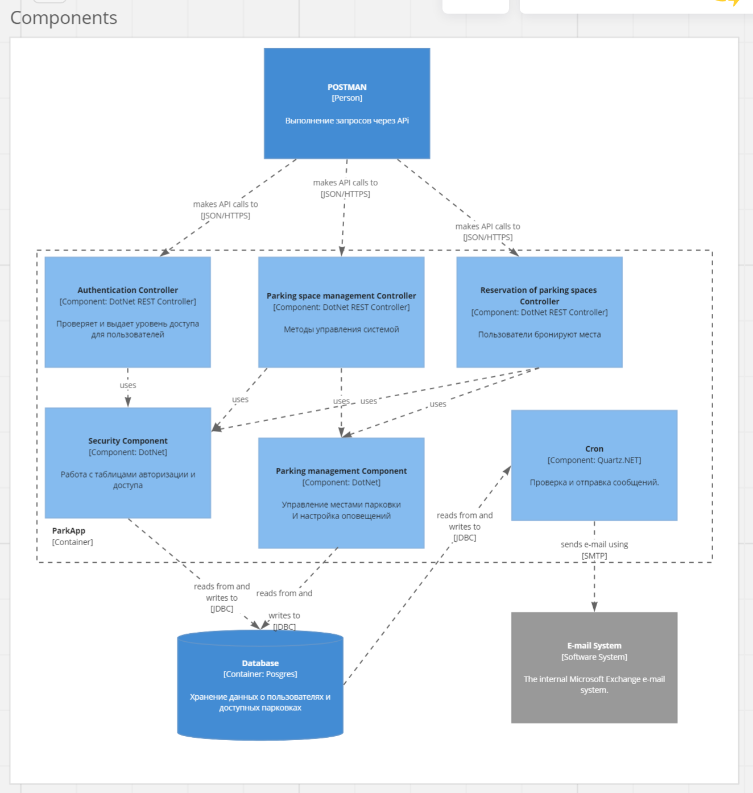

# Система бронирования парковки "ParkApp"

**Архитектор**: Станислав Волков / Название организации  
**Дата:** 08 Октября 2023

### История версий

> ***Опционально***  
> Отражает изменения, внесенные в документ, включая дату, версию, описание изменения и автора

|    Дата    | Автор | Что изменилось  | 
|:----------:| :-: |:---------------:|
| 08.10.2023 | Станислав Волков | Создан документ | 

### Краткий обзор

> Краткий обзор всей архитектуры решения. Должен предоставлять общее представление о целях проекта, ключевых особенностях, основных преимуществах, ожидаемых затратах и потенциальных рисках. Главным образом предназначено для лиц, принимающих решения, которые могут не углубляться в детальные разделы документа.

##### Название проекта: Система бронирования парковки "ParkApp" 

Требуется cистема бронирования парковки для автоматизации работы офис-менеджера. 
Проект Система бронирования парковки "ParkApp" - это наш ответ на эти запросы, в будущем мы готовы расширить продукт для внедрения у арендодателся. 

##### Цель

Автоматизация работ по бронированию парковочных мест 

##### КЛЮЧЕВЫЕ ОСОБЕННОСТИ

- ***РАБОТА ПО HTTP API:*** Обеспечивает оптимальные возможности по интеграции различных UI и врнешних api.
- ***ИСКЛЮЧЕНИЕ ОШИБОК ПРИ ПЕРЕДАЧЕ НОМЕРА:*** Поскольку посльзователь вносит данные сам, уменьшается вероятность внесения не правильного номера. 
- ***ВОЗМОЖНОСТЬ ОТСЛЕЖИВАТЬ ДОСТУПНОСТЬ МЕСТ:*** Благодоря единому месту хранения карты о доступных местах решается проблема двойного бронирования мест. 
- ***ПРЕИМУЩЕСТВА:*** Позволяет уменьшить нагрузку на офис-менеджера, уменьшить количество ошибок при бронировании, уменьшить количество двойных бронирований. 
- ***ОРИЕНТИРОВОЧНАЯ СТОИМОСТЬ:*** Общие инвестиции в этот проект оцениваются в 100 тыс. рублей, с прогнозируемой окупаемостью инвестиций в 100% в течение следующих трех лет трех лет на зарплату офис-менеджера. 
- ***РИСКИ:*** Отсуствие приемлемого UI в будущем. Необходимость обучения персонала новой платформе. 

Проект Система бронирования парковки "ParkApp" - это инвестиции в наше будущее, первый шаг для разработки платного продукта автоматизации офисных задач

### Введение

> В этом разделе представлена ключевая терминология по архитектуре решения и границы проекта. Он разработан для того, чтобы все заинтересованные стороны имели общее понимание, и не было двусмысленностей в терминах или границах проекта.

### Ключевые термины, определения, аббревиатуры

> ***Опционально***  
> Представляет любую специализированную терминологию, сокращения или аббревиатуры, используемые в документе. Это помогает обеспечить ясность и понимание для всех заинтересованных сторон.

| Термин | Определение |
|:-:|:-|
| СУБД | Система управления базами данных |

### Границы проекта

> Четко определяет, что включено в проект, и, что не менее важно, что исключено. Это устанавливает четкие границы для целей проекта, результатов, функций и функциональных возможностей.

##### Включено: 
- Разработка HTTP API. 
- Модуль доступа к системе.
- Управление базой парковки.
- Настройка оповещений.
- Бронирование парковачных мест. 
##### Исключено:
- Интеграция с внешней системой авторизации.
- Оповещения не по e-mail. 
- Разработка UI.

### Требования

Система представляет собой HTTP API со следующими требованиями к бизнес-логике:

* *Для сотрудников*:
    * доступ по логину (добавляется офис-менеджером в систему);
    * запрос списка доступных для бронирования мест на выбранную дату вместе со схемой парковки;
    * просмотр, создание, перенос и отмена бронирований парковочных мест на корпоративной парковке;
    * учёт и ведение бронирований с выводом остатка дней в текущем месяце;
* *Для офис-менеджера*:
    * регистрация по секретному коду;
    * добавление и удаление логинов сотрудников в систему;
    * добавление и удаление схемы парковки с кодовыми обозначениями парковочных мест.
    * добавление и удаление парковочных мест;
    * установка лимитов на количество бронирований в месяц для сотрудников;
    * установка времени, шаблона письма и адреса получателя для автоматической повторяющейся отправки информации о бронированиях (см. ниже);
* Автоматическая повторяющаяся отправка электронного письма на заданный адрес. Письмо содержит список регистрационных номеров автомобилей из списка бронирований на следующие сутки;

#### Заинтересованные стороны

> Определяет и описывает основные группы или отдельных лиц, которые заинтересованы/участвуют в проекте, его результатах или затрагиваются его итогами. Важно понимать их потребности, опасения и влияние. 

> [!NOTE]
>  - **Сторона:** Указывает на группу или категорию, к которой принадлежит заинтересованная сторона. Это может быть отдел, группа пользователей или внешняя организация. 
>  - **Имя:** Если применимо, это было бы конкретное лицо, представляющее сторону-участника, особенно актуально для ключевых лиц, принимающих решения, или основных контактных лиц. 
>  - **Роль/Должность:** Определяет основную функцию или отношение участника к проекту. 
>  - **Интересы/Опасения:** Описывает конкретные интересы, риски или потребности, которые участник может иметь в отношении проекта.

|    Сторона    |       Имя        | Роль/Должность | Интересы/Опасения                                                  |
|:-------------:|:----------------:|:--------------:|:-------------------------------------------------------------------|
| Администратор |  Полина Иванова  |  Офис-менджеп  | Согласованные и подробно описанные требования                      |
| Пользователи  |   Иван Иванов    |   Сотрудники   | Согласованные и подробно описанные требования                      |
| Арендодатель  | Михаил Востриков | Управляющий УК | Возможность маштабирования и внедрения проекта на всех арендаторов |
|   Охрана БЦ   |  Иван Прусихин   |    Охранник    | Получние списка машин вовремя                                      |

#### Функциональные требования

> Описывает конкретные функциональные возможности, которые система должна предоставлять в четких, выполнимых терминах.

> [!NOTE]
> - **Группа:** Категория или модуль, к которому принадлежит функциональное требование. 
> - **ID:** Уникальный идентификатор для каждого требования. Это помогает в отслеживании, ссылке и управлении требованием на протяжении всего его жизненного цикла. 
> - **Описание:** Четкое и подробное изложение требования, объясняющее, какая конкретная функциональность или поведение ожидается.
> - **Приоритет:** Определяет важность требования по отношению к другим требованиям. Обычно используются уровни **ВЫСОКИЙ**, **СРЕДНИЙ** и **НИЗКИЙ**. Другие шкалы, такие как **MOSCOW (ОБЯЗАТЕЛЬНО, ЖЕЛАТЕЛЬНО, ВОЗМОЖНО, НЕ ТРЕБУЕТСЯ)**, также могут быть использованы в зависимости от организационных предпочтений.

| Группа | ID | Описание                                                                                                                     | Приоритет |
| :-: | :-: |:-----------------------------------------------------------------------------------------------------------------------------| :-: |
| Доступ к системе                  | F001 | Регистрация офис-менеджера по секретному коду                                                                                | ВЫСОКИЙ |
| Доступ к системе                  | F002 | Добавление логина сотрудника в системе                                                                                       | ВЫСОКИЙ |
| Доступ к системе                  | F003 | Получение списка сотрудников в системе                                                                                       | СРЕДНИЙ |
| Доступ к системе                  | F004 | Удаление логина сотрудника в системе                                                                                         | СРЕДНИЙ |
| Доступ к системе                  | F005 | Получение информации о сотруднике в системе                                                                                  | СРЕДНИЙ |
| Доступ к системе                  | F006 | Доступ по логину сотруднику                                                                                                  | ВЫСОКИЙ |
| Доступ к системе                  | F007 | Доступ по логину офис-менеджеру                                                                                              | ВЫСОКИЙ |
| Доступ к системе                  | F008 | Добавление секретного кода для регистрации офис-менеджера                                                                    | ВЫСОКИЙ |
| Управление базой парковачных мест | F101 | Добавление схемы парковки с кодовыми обозначениями парковочных мест                                                          | ВЫСОКИЙ |
| Управление базой парковачных мест | F102 | Удаление схемы парковки с кодовыми обозначениями парковочных мест                                                            | Обязательно |
| Управление базой парковачных мест | F103 | Добавление парковочных мест                                                                                                  | ВЫСОКИЙ |
| Управление базой парковачных мест | F104 | Удаление парковочных мест                                                                                                    | Обязательно |
| Управление базой парковачных мест | F105 | Установка лимитов на количество бронирований в месяц для сотрудника                                                          | Обязательно |
| Настройка оповещений              | F201 | Настройка шаблона письма для автоматической повторяющейся отправки информации о бронированиях                                | Обязательно |
| Настройка оповещений              | F202 | Настройка адресов получателя для автоматической повторяющейся отправки информации о бронированиях                            | Обязательно |
| Настройка оповещений              | F203 | Установка времени для автоматической повторяющейся отправки информации о бронированиях                                       | Обязательно |
| Настройка оповещений              | F204 | Установка времени для автоматической повторяющейся отправки информации о бронированиях на пост охраны                        | Обязательно |
| Настройка оповещений              | F205 | Настройка адресов получателя для автоматической повторяющейся отправки информации о бронированиях на пост охраны             | Обязательно |
| Бронирование парковачных мест     | F301 | Запрос списка доступных для бронирования мест на выбранную дату вместе со схемой парковки                                    | ВЫСОКИЙ |
| Бронирование парковачных мест              | F302 | Запрос остатка  дней бронирования в текущем месяце                                                                           | СРЕДНИЙ |
| Бронирование парковачных мест              | F303 | Просмотр своих бронирований парковочных мест на корпоративной парковке                                                       | СРЕДНИЙ |
| Бронирование парковачных мест              | F304 | Создание бронирований парковочных мест на корпоративной парковкех                                                            | ВЫСОКИЙ |
| Бронирование парковачных мест              | F305 | Перенос бронирований парковочных мест на корпоративной парковке                                                              | СРЕДНИЙ |
| Бронирование парковачных мест              | F306 | Отмена бронирований парковочных мест на корпоративной парковкех                                                              | СРЕДНИЙ |

#### Нефункциональные требования

> Охватывает качество или критерии функционирования системы, такие как производительность, масштабируемость и безопасность.

> [!NOTE]
> - **Группа:** Категория или атрибут качества, к которому принадлежит нефункциональное требование ([список общих атрибутов качества для использования:](https://en.wikipedia.org/wiki/List_of_system_quality_attributes))
> - **ID:** Уникальный идентификатор для каждого требования.
> - **Описание:** Четкое и подробное изложение требования.
> - **Приоритет:** Определяет важность требования по отношению к другим требованиям. Обычно используются уровни **ВЫСОКИЙ**, **СРЕДНИЙ** и **НИЗКИЙ**. Другие шкалы, такие как **MOSCOW (ОБЯЗАТЕЛЬНО, ЖЕЛАТЕЛЬНО, ВОЗМОЖНО, НЕ ТРЕБУЕТСЯ)**, также могут быть использованы в зависимости от организационных предпочтений.

| Группа | ID | Описание | Приоритет |
| :-: | :-: | :- |:---------:|
| Responsiveness | NFR-001 | Время реакции системы для 95% действий пользователей не должно превышать 2 секунды |  Высокий  |
| Безопасность     | U001 | Пользователи проходят авторизацию в системе               |  Высокий  |
| Безопасность     | U002 | Добавлние секретных кодов не доступно пользователям       |  Средний  |
| Производительность     | U101 | 18 пользователей                                          |  Высокий  |
| Масштабируемость     | U201 | Иметь возможность маштобироваться до 10 000 пользователей |  Высокий  |
| Интерация     | U301 | Интеграция с внешней системой аутентификации                 |  Низкий   |

#### Ограничения

> Перечисляются ограничения, в рамках которых должна работать команда проекта, такие как технологические, финансовые или временные ограничения.

> [!NOTE]
> - **Тип:** Категория или характер ограничения, например: техническое, финансовое, временное и т. д.
> - **ID:** Уникальный идентификатор для каждого ограничения
> - **Описание:** Четкое и подробное описание ограничения.

| Тип | ID | Описание |
| :-: | :-: | :- |
| Сроки   | R001 | 4 недели на разработку           |
| Ресурсы | R101 | 20  человеко-часов на разработку |
| Границы проекта | R201 | Реализуем HTTP API без UI        |

#### Предположения

> Документируются все предполагаемые факты или условия, которые будут влиять на решения проекта. Они часто служат основой для рисков, так как предположения часто включают в себя некоторую степень неопределенности.

> [!NOTE]
> - **ID:** Уникальный идентификатор для каждого предположения для легкого его учета.
> - **Описание:** Четкое и краткое изложение предположения.

|  ID  | Описание                                                                                             |
|:----:|:-----------------------------------------------------------------------------------------------------|
| A001 | Пользовательский трафик увеличится на 1000% в первые шесть месяцев после развертывания.              |
| A002 | Существующая IT-команда обладает необходимыми навыками для поддержки и обслуживания новой платформы. |

---
### Текущая архитектура

>***Опционально***
>Этот раздел предоставляет подробное описание текущего состояния архитектуры. Для обеспечения последовательности в представлении и упрощения сравнения с "Целевой архитектурой" рекомендуется использовать те же разделы/подразделы, что и в "Целевой архитектуре".

---
### Целевая архитектура
#### Диаграма С1 (context)

#### Диаграма С2 (containers)

#### Диаграма С3 (components)

>Этот раздел предоставляет всесторонний взгляд на предлагаемую архитектуру системы, учитывая как технические, так и бизнес-аспекты. Он включает в себя детали компонентов системы, их взаимоотношений, потока данных и других архитектурных аспектов, необходимых для достижения целей проекта.

##### Обзор

>Краткое резюме общей целевой архитектуры, создающее основу для более подробных представлений, которые следуют далее.

##### Функциональное Представление

>***Опционально***  
>Описывает функциональные элементы системы, их обязанности, взаимодействия и отношения.

##### Развертывание

>***Опционально***  
>Описывает физическое и виртуальное развертывание программных компонентов, учитывая аспекты масштабирования, распределения и механизмов отказоустойчивости.

##### Процессы

>***Опционально***  
>Описывает динамическое поведение системы, изображая параллельные процессы, синхронизацию и последовательность событий.

##### Данные

>***Опционально***  
>Описывает аспекты данных системы, включая модели данных, механизмы хранения, отношения и потоки данных.

##### Безопасность

>***Опционально***  
>Описывает меры и стратегии для обеспечения безопасности системы. Это может включать в себя детали об аутентификации, авторизации, шифровании, обнаружении вторжений и т. д.

##### Производительность

>***Опционально***  
>Описывает стратегии для достижения желаемых показателей производительности. Это может охватывать аспекты, такие как задержка, пропускная способность, распределение нагрузки и техники оптимизации.

##### Сетевое взаимодействие

>***Опционально***  
>Описывает аспекты связи, топологии сети и протоколы, учитывая пропускную способность, задержку и другие сетевые факторы.

---
### Альтернативные варианты

>***Опционально***  
>В этом разделе описываются альтернативные решения или архитектуры, которые рассматривались на этапе планирования. Детализация этих вариантов и причины их невыбора помогают обеспечить ясность и прозрачность в процессах принятия решений.

##### 1. Развертывание на собственных серверах
- **Описание:** Основные характеристики и особенности этой альтернативы.
- **Преимущества:** Преимущества или сильные стороны.
- **Ограничения:** Возможные проблемы или недостатки.
- **Причина отказа от варианта:** Объяснение, почему этот вариант не был выбран.
##### 2. Гибридное облачное решение
- **Описание:** Основные характеристики и особенности этой альтернативы.
- **Преимущества:** Преимущества или сильные стороны.
- **Ограничения:** Возможные проблемы или недостатки.
- **Причина отказа от варианта:** Объяснение, почему этот вариант не был выбран.

##### Критерии оценки

>***Опционально***  
>Опишите метрики или критерии, используемые для оценки каждого варианта. Это может включать в себя стоимость, масштабируемость, простоту внедрения, совместимость с существующими системами и т. д.

##### Итог

>***Опционально***  
>Заключение об рассмотренных альтернативах и причин, по которым было принято окончательное решение. В этом разделе также можно указать любые планы по повторному рассмотрению этих альтернатив в будущем, если это актуально.

---
### Риски

>Этот раздел описывает потенциальные риски, которые могут повлиять на успешную реализацию или функционирование решения. Риски следует регулярно пересматривать, переоценивать и обновлять по мере продвижения проекта. Для каждого риска следует предоставить стратегии смягчения и реагирования.

> [!NOTE]
> - **ID Риска:** Уникальный идентификатор для каждого риска для легкого его учета (например, R-001).
> - **Описание:** Краткое описание риска.
> - **Влияние:** Серьезность риска в случае его реализации. Обычно оценивается как НИЗКОЕ, СРЕДНЕЕ, ВЫСОКОЕ или КРИТИЧНОЕ.
> - **Вероятность:** Вероятность возникновения риска. Обычно категоризируется как НИЗКАЯ, СРЕДНЯЯ или ВЫСОКАЯ. 
> - **Стратегия смягчения:** Проактивные меры, принимаемые для предотвращения или снижения вероятности или воздействия риска.
> - **Стратегия реагирования:** Реактивные меры, запланированные на случай реализации риска.

| ID Риска | Описание                     | Влияние | Вероятность | Стратегия смягчения                                  | Стратегия реагирования         |
|:--------:|:-----------------------------|:-------:|:-----------:|:-----------------------------------------------------|:-------------------------------|
|   R001   | Выделение ресурса разработки | Высокое |   Низкая    | Договориться и утвердить ресурс до начала разработки | Репланирование имеющихся задач |

---

### Бюджет и дорожная карта

>Этот раздел предоставляет стратегический взгляд на то, как будет внедрено решение, детализируя ключевые этапы и планируемые действия на пути. Это выравнивает ожидания и предоставляет основу для отслеживания и измерения прогресса.

#### Дорожная карта

>Для представления временной шкалы проекта можно использовать диаграмму Ганта высокого уровня или аналогичный визуальный инструмент. На нем следует выделить основные этапы, действия и соответствующие временные рамки. Если предполагается фазовый подход, укажите фазы и связанные с ними действия.

#### Планирование ресурсов

> В этом подразделе следует подробно описать необходимые ресурсы, как в плане рабочей силы, так и в плане инфраструктуры. Укажите роли, необходимые навыки и оцененные затраты в человеко-часах или человеко-днях. Не забудьте включить ресурсы для деятельности, не связанной с разработкой, такой как обучение, документация и поддержка. 

| Роль                       | Цена за месяц (РУБ) | Ноябрь |   Итог (РУБ)    |
|:---------------------------| -: | -: |:---------------:|
| **Архитектор Решений**     |100 000|0.01|      1 000      |
| **Разработчик (Backend)**  |80 000|0.025|      2 000      |
| **DevOps**                 |60 000|0.01|       600       |
| **Офис-менеджер**          |40 000|0.01|       400       |

Предполагаемый общий бюджет на разработку MVP в течение 4 недель, на основе подробного распределения ресурсов, составляет 4 000
