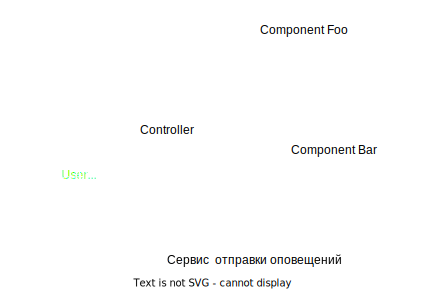
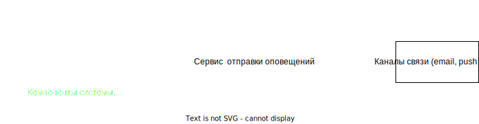

# Технический проект "Сервис отправки оповещений"

**Архитектор**: Станислав Волков / Название организации  
**Дата:** 10 Октября 2023

### История версий

> ***Опционально***  
> Отражает изменения, внесенные в документ, включая дату, версию, описание изменения и автора

|    Дата    | Автор | Что изменилось  | 
|:----------:| :-: |:---------------:|
| 10.10.2023 | Станислав Волков | Создан документ | 

### Краткий обзор

> Краткий обзор всей архитектуры решения. Должен предоставлять общее представление о целях проекта, ключевых особенностях, основных преимуществах, ожидаемых затратах и потенциальных рисках. Главным образом предназначено для лиц, принимающих решения, которые могут не углубляться в детальные разделы документа.

##### Название проекта: "Сервис отправки оповещений"

Требуется cистема отправки оповещений.
Проект "Сервис отправки оповещений" - это наш ответ на эти запросы.

##### Цель

Построить маштабируюемую высоко-производительную ситему по отправке оповещений в 3 канала (SMS, E-Mail, Push-уведомления).

##### КЛЮЧЕВЫЕ ОСОБЕННОСТИ

- ***ИСПОЛЬЗОВАНИЕ KAFKA:*** Обеспечиват демпфер по обработки пиков нагрузки и хранит запросы на отправку уведомлений в упорядоченном виде.
- ***STATELESS СЕРВИСЫ:*** Все сервисы не хранят данные, поэтому их удобно маштабировать.
- ***MICROSERVICE АРХИТЕКТУРА:*** Каждый бизнес процесс(Запрос на отправку, настройки, контроль настроек, отправка сообщений) выделен в отдельный сервис что позволяет маштабировать только те части системы которые испытываю нагрузку.
- ***ПРЕИМУЩЕСТВА:*** Повышение качества обслуживания клиентов, сокращение расходов на обслуживание клиентов, в следствие лучшего котроля работы системы.
- ***ОРИЕНТИРОВОЧНАЯ СТОИМОСТЬ:*** Общие инвестиции в этот переход оцениваются в $1 млн, с прогнозируемой окупаемостью инвестиций в 60% в течение следующих трех лет.
- ***РИСКИ:*** Возможные краткосрочные перебои во время перехода от устаревшей системы.

Проект "Сервис отправки оповещений" - это инвестиции в наше будущее, один из шагов по построению маштабируемой и высокопроизводительной системы

### Введение

> В этом разделе представлена ключевая терминология по архитектуре решения и границы проекта. Он разработан для того, чтобы все заинтересованные стороны имели общее понимание, и не было двусмысленностей в терминах или границах проекта.

### Ключевые термины, определения, аббревиатуры

> ***Опционально***  
> Представляет любую специализированную терминологию, сокращения или аббревиатуры, используемые в документе. Это помогает обеспечить ясность и понимание для всех заинтересованных сторон.

| Термин | Определение |
|:-:|:-|
| СУБД | Система управления базами данных |

### Границы проекта

> Четко определяет, что включено в проект, и, что не менее важно, что исключено. Это устанавливает четкие границы для целей проекта, результатов, функций и функциональных возможностей.

##### Включено:
- Отправка сообщений.
- Настроки отправки сообщений.
##### Исключено:
- Интеграция с внешней системой авторизации.
- Разработка UI для настроек.

### Требования

Система представляет собой проект со следующими требованиями к бизнес-логике:

* *В части оповещений*:
    * отправка оповещений в 3 канала (SMS, E-Mail, Push-уведомления);
    * сообщений и их содержимого будут являться другие подсистемы, следовательно необходим подходящий способ взаимодействия с ними;
    * необходима возможность мультиплексирования (рассылки одного сообщения по всем каналам группе клиентов) так и адресной отправки в каждый канал связи конкретным адресатам;
    * учтитывать природу разных каналов связи, их потенциальные ограничения и пропускную способность (например, ограничение количества символов в СМС, стоимость СМС, лимиты пуш-очередей провайдеров, возможность попадания e-mail в спам и т.д.);
* *В части настроек*:
    * требуется принимать от пользователя системы настройки по каждому каналу связи для рассылки уведомлений (вкл/выкл, адрес/номер/логин) и учитывать эти настройки при последующих рассылках;
    * хранения пользовательских настроек необходимо предусмотреть хранилище, связанное с пользовательской информацией в других подсистемах;
    * 

#### Заинтересованные стороны

> Определяет и описывает основные группы или отдельных лиц, которые заинтересованы/участвуют в проекте, его результатах или затрагиваются его итогами. Важно понимать их потребности, опасения и влияние.

> [!NOTE]
>  - **Сторона:** Указывает на группу или категорию, к которой принадлежит заинтересованная сторона. Это может быть отдел, группа пользователей или внешняя организация.
>  - **Имя:** Если применимо, это было бы конкретное лицо, представляющее сторону-участника, особенно актуально для ключевых лиц, принимающих решения, или основных контактных лиц.
>  - **Роль/Должность:** Определяет основную функцию или отношение участника к проекту.
>  - **Интересы/Опасения:** Описывает конкретные интересы, риски или потребности, которые участник может иметь в отношении проекта.

|    Сторона    |       Имя        |  Роль/Должность  | Интересы/Опасения                                                  |
|:-------------:|:----------------:|:----------------:|:-------------------------------------------------------------------|
| Пользователи |  Полина Иванова  | Отдел разработки | Согласованные и подробно описанные требования                      |
| Пользователи  |   Иван Иванов    |     Клиенты      | Получение уведомлений в приемлемое время                           |

#### Функциональные требования

> Описывает конкретные функциональные возможности, которые система должна предоставлять в четких, выполнимых терминах.

> [!NOTE]
> - **Группа:** Категория или модуль, к которому принадлежит функциональное требование.
> - **ID:** Уникальный идентификатор для каждого требования. Это помогает в отслеживании, ссылке и управлении требованием на протяжении всего его жизненного цикла.
> - **Описание:** Четкое и подробное изложение требования, объясняющее, какая конкретная функциональность или поведение ожидается.
> - **Приоритет:** Определяет важность требования по отношению к другим требованиям. Обычно используются уровни **ВЫСОКИЙ**, **СРЕДНИЙ** и **НИЗКИЙ**. Другие шкалы, такие как **MOSCOW (ОБЯЗАТЕЛЬНО, ЖЕЛАТЕЛЬНО, ВОЗМОЖНО, НЕ ТРЕБУЕТСЯ)**, также могут быть использованы в зависимости от организационных предпочтений.

|              Группа               | ID | Описание                                                                                                                     | Приоритет |
|:---------------------------------:| :-: |:-----------------------------------------------------------------------------------------------------------------------------| :-: |
|   Обработка запроса оповещения    | F001 | Регистрация офис-менеджера по секретному коду                                                                                | ВЫСОКИЙ |
|         Доступ к системе          | F002 | Добавление логина сотрудника в системе                                                                                       | ВЫСОКИЙ |
|         Доступ к системе          | F003 | Получение списка сотрудников в системе                                                                                       | СРЕДНИЙ |
|         Доступ к системе          | F004 | Удаление логина сотрудника в системе                                                                                         | СРЕДНИЙ |
|         Доступ к системе          | F005 | Получение информации о сотруднике в системе                                                                                  | СРЕДНИЙ |
|         Доступ к системе          | F006 | Доступ по логину сотруднику                                                                                                  | ВЫСОКИЙ |
|         Доступ к системе          | F007 | Доступ по логину офис-менеджеру                                                                                              | ВЫСОКИЙ |
|         Доступ к системе          | F008 | Добавление секретного кода для регистрации офис-менеджера                                                                    | ВЫСОКИЙ |
|        Настроки оповещений        | F101 | Добавление схемы парковки с кодовыми обозначениями парковочных мест                                                          | ВЫСОКИЙ |
| Управление базой парковачных мест | F102 | Удаление схемы парковки с кодовыми обозначениями парковочных мест                                                            | Обязательно |
| Управление базой парковачных мест | F103 | Добавление парковочных мест                                                                                                  | ВЫСОКИЙ |
| Управление базой парковачных мест | F104 | Удаление парковочных мест                                                                                                    | Обязательно |
| Управление базой парковачных мест | F105 | Установка лимитов на количество бронирований в месяц для сотрудника                                                          | Обязательно |
|         Контроль лиммитов         | F201 | Настройка шаблона письма для автоматической повторяющейся отправки информации о бронированиях                                | Обязательно |
|    Отправка поставщику канала     | F202 | Настройка адресов получателя для автоматической повторяющейся отправки информации о бронированиях                            | Обязательно |
|       Настройка оповещений        | F203 | Установка времени для автоматической повторяющейся отправки информации о бронированиях                                       | Обязательно |
|       Настройка оповещений        | F204 | Установка времени для автоматической повторяющейся отправки информации о бронированиях на пост охраны                        | Обязательно |
|       Настройка оповещений        | F205 | Настройка адресов получателя для автоматической повторяющейся отправки информации о бронированиях на пост охраны             | Обязательно |
|   Отправка поставщику канала   | F301 | Запрос списка доступных для бронирования мест на выбранную дату вместе со схемой парковки                                    | ВЫСОКИЙ |
|   Бронирование парковачных мест   | F302 | Запрос остатка  дней бронирования в текущем месяце                                                                           | СРЕДНИЙ |
|   Бронирование парковачных мест   | F303 | Просмотр своих бронирований парковочных мест на корпоративной парковке                                                       | СРЕДНИЙ |
|   Бронирование парковачных мест   | F304 | Создание бронирований парковочных мест на корпоративной парковкех                                                            | ВЫСОКИЙ |
|   Бронирование парковачных мест   | F305 | Перенос бронирований парковочных мест на корпоративной парковке                                                              | СРЕДНИЙ |
|   Бронирование парковачных мест   | F306 | Отмена бронирований парковочных мест на корпоративной парковкех                                                              | СРЕДНИЙ |

#### Нефункциональные требования

> Охватывает качество или критерии функционирования системы, такие как производительность, масштабируемость и безопасность.

> [!NOTE]
> - **Группа:** Категория или атрибут качества, к которому принадлежит нефункциональное требование ([список общих атрибутов качества для использования:](https://en.wikipedia.org/wiki/List_of_system_quality_attributes))
> - **ID:** Уникальный идентификатор для каждого требования.
> - **Описание:** Четкое и подробное изложение требования.
> - **Приоритет:** Определяет важность требования по отношению к другим требованиям. Обычно используются уровни **ВЫСОКИЙ**, **СРЕДНИЙ** и **НИЗКИЙ**. Другие шкалы, такие как **MOSCOW (ОБЯЗАТЕЛЬНО, ЖЕЛАТЕЛЬНО, ВОЗМОЖНО, НЕ ТРЕБУЕТСЯ)**, также могут быть использованы в зависимости от организационных предпочтений.

| Группа | ID | Описание | Приоритет |
| :-: | :-: | :- |:---------:|
| Responsiveness | NFR-001 | Время реакции системы для 95% действий пользователей не должно превышать 2 секунды |  Высокий  |
| Безопасность     | U001 | Пользователи проходят авторизацию в системе               |  Высокий  |
| Безопасность     | U002 | Добавлние секретных кодов не доступно пользователям       |  Средний  |
| Производительность     | U101 | 18 пользователей                                          |  Высокий  |
| Масштабируемость     | U201 | Иметь возможность маштобироваться до 10 000 пользователей |  Высокий  |
| Интерация     | U301 | Интеграция с внешней системой аутентификации                 |  Низкий   |

#### Ограничения

> Перечисляются ограничения, в рамках которых должна работать команда проекта, такие как технологические, финансовые или временные ограничения.

> [!NOTE]
> - **Тип:** Категория или характер ограничения, например: техническое, финансовое, временное и т. д.
> - **ID:** Уникальный идентификатор для каждого ограничения
> - **Описание:** Четкое и подробное описание ограничения.

| Тип | ID | Описание |
| :-: | :-: | :- |
| Сроки   | R001 | 4 недели на разработку           |
| Ресурсы | R101 | 20  человеко-часов на разработку |
| Границы проекта | R201 | Реализуем HTTP API без UI        |

#### Предположения

> Документируются все предполагаемые факты или условия, которые будут влиять на решения проекта. Они часто служат основой для рисков, так как предположения часто включают в себя некоторую степень неопределенности.

> [!NOTE]
> - **ID:** Уникальный идентификатор для каждого предположения для легкого его учета.
> - **Описание:** Четкое и краткое изложение предположения.

|  ID  | Описание                                                                                             |
|:----:|:-----------------------------------------------------------------------------------------------------|
| A001 | Пользовательский трафик увеличится на 1000% в первые шесть месяцев после развертывания.              |
| A002 | Существующая IT-команда обладает необходимыми навыками для поддержки и обслуживания новой платформы. |

---

## Текущая архитектура

В текущей архитектуре у нас есть мобильное приложение, которое общается с компонентом "Controller", а он в свою очередь делает запросы к "Foo" и "Bar".

## Целевая архитектура
### Диаграмма контекста (C1):

Предполагается, что любой из существующих компонентов может отправить оповещение пользователю. При этом существующие каналы связи и предпочтения по их использованию известны системе оповещений, компоненты остальной системы знать это не должны.

### Диаграмма контекста (C2):
Результаты встреч перед C2
* [Получение запроса и хранение настроек](adr_1.md)
* [Выбор способа и места хранение сообщений и контроля лимитов](adr_2.md)
* [Обсуждение отправки сообщений](adr_3.md)
* [Уточнение архитектуры отправки сообщений](adr_4.md)

### Диаграмма контекста (C3):

Результаты встреч перед C3
* [Обсуждение архитектуры NotificationService](adr_5.md)

Результаты последующих встреч
* [Выбор протокола взаимодействия](adr_6.md)
